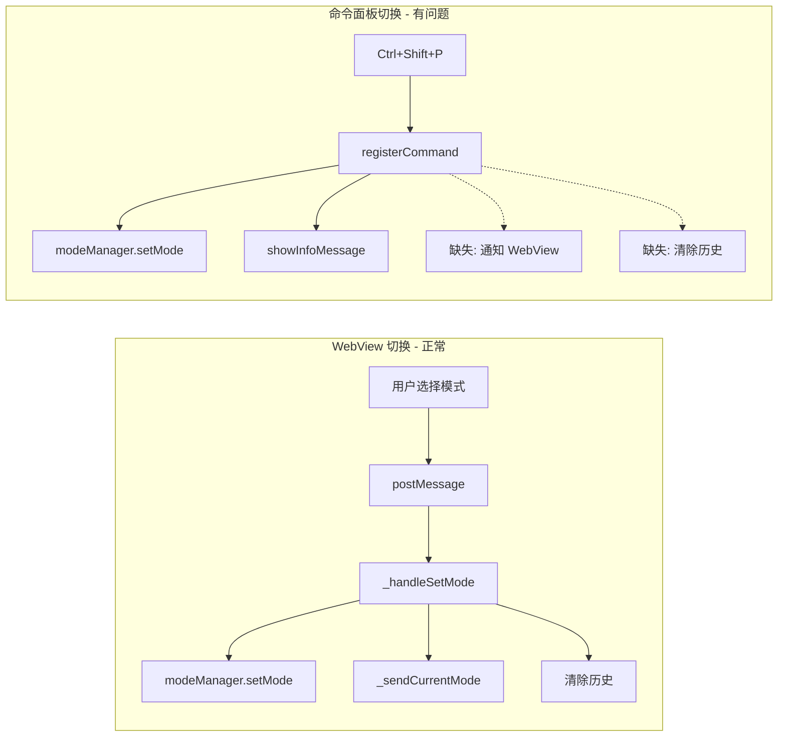

# 命令面板模式切换同步修复

## 问题分析

当前两种模式切换的数据流：



## 修复方案

在 [VSCodeToolsViewProvider](packages/extension/src/webview-view-provider.ts) 中添加公开方法，然后从 [extension.ts](packages/extension/src/extension.ts) 的命令处理中调用它。

### 1. 修改 webview-view-provider.ts

添加公开方法 `notifyModeChanged()`：

```typescript
/** 外部调用：通知模式已变更，同步 UI 和清除历史 */
public notifyModeChanged(): void {
  this._sendCurrentMode();
  this._messages = [];
  console.log("模式已通过外部命令切换，UI 已同步，历史已清除");
}
```

### 2. 修改 extension.ts

在每个模式切换命令中，调用 provider 的同步方法：

```typescript
commands.registerCommand('vscode-tools.mode.code', () => {
  modeManager.setMode('code');
  provider?.notifyModeChanged();  // 新增
  window.showInformationMessage('已切换到代码模式');
})
```

对 4 个模式命令都做同样的修改：

- `vscode-tools.mode.code`
- `vscode-tools.mode.architect`
- `vscode-tools.mode.ask`
- `vscode-tools.mode.debug`

## 修改文件清单

| 文件 | 修改内容 |

|------|----------|

| `packages/extension/src/webview-view-provider.ts` | 新增 `notifyModeChanged()` 公开方法 |

| `packages/extension/src/extension.ts` | 4 个模式命令中调用 `provider?.notifyModeChanged()` |