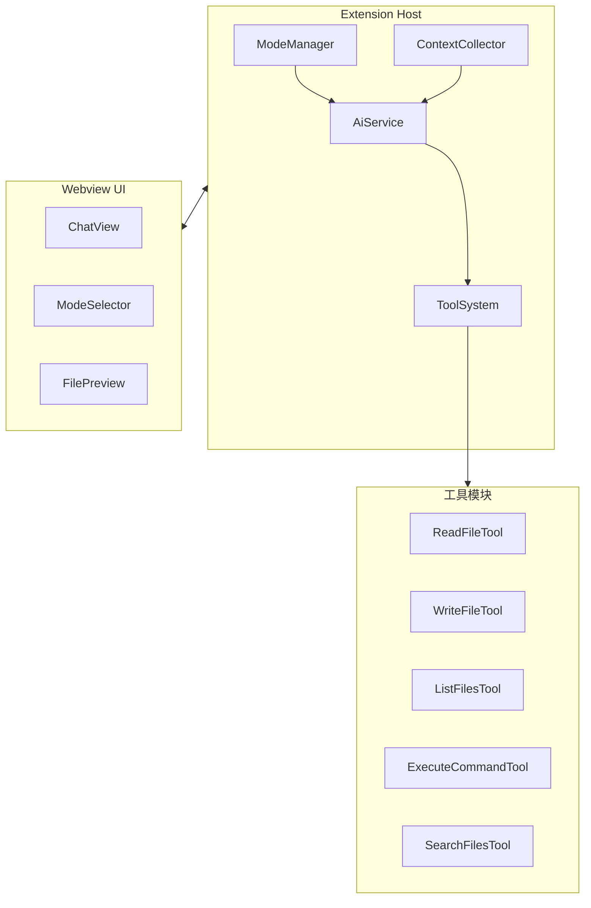

# Roo-Code 功能集成方案

## 现状分析

### vscode-tools 已有能力

- 基于 OpenAI 兼容 API 的 AI 对话
- 流式响应 + 思考标签解析
- Vue.js webview UI
- 简单的消息历史管理

### 待集成的 Roo-Code 功能（按优先级）

1. **工具系统** - 让 AI 能执行实际操作
2. **文件操作** - 读写、搜索文件
3. **终端集成** - 执行命令
4. **模式系统** - 区分使用场景
5. **上下文感知** - 理解当前代码库

---

## 架构设计

### 核心模块关系



---

## 阶段 1：工具系统基础

### 1.1 创建工具抽象层

在 [`packages/extension/src/tools/`](packages/extension/src/tools/) 目录下创建：

**`BaseTool.ts`** - 工具基类

```typescript
export interface ToolResult {
  success: boolean;
  content: string;
  error?: string;
}

export interface ToolInput {
  [key: string]: unknown;
}

export abstract class BaseTool<T extends ToolInput = ToolInput> {
  abstract name: string;
  abstract description: string;
  abstract inputSchema: object;
  
  abstract execute(input: T): Promise<ToolResult>;
}
```

**`ToolRegistry.ts`** - 工具注册表

```typescript
export class ToolRegistry {
  private tools = new Map<string, BaseTool>();
  
  register(tool: BaseTool): void;
  get(name: string): BaseTool | undefined;
  getAll(): BaseTool[];
  getToolDefinitions(): object[]; // 用于发送给 AI
}
```

### 1.2 实现核心工具

| 工具 | 功能 | 优先级 |

|------|------|--------|

| `read_file` | 读取文件内容 | 高 |

| `write_to_file` | 创建/覆写文件 | 高 |

| `list_files` | 列出目录内容 | 高 |

| `search_files` | 正则搜索文件内容 | 中 |

| `execute_command` | 执行终端命令 | 中 |

### 1.3 修改 AiService 支持工具调用

关键修改点在 [`packages/extension/src/ai_service.ts`](packages/extension/src/ai_service.ts)：

```typescript
// 1. 请求体添加 tools 参数
body: JSON.stringify({
  model,
  messages,
  stream: true,
  tools: this.toolRegistry.getToolDefinitions(),
  tool_choice: "auto"
})

// 2. 处理 tool_calls 响应
if (delta.tool_calls) {
  // 收集完整的工具调用
  // 执行工具
  // 将结果作为 tool message 添加到对话
  // 继续调用 AI
}
```

---

## 阶段 2：文件操作工具实现

### 2.1 ReadFileTool

参考 Roo-Code 的 [`src/core/tools/ReadFileTool.ts`](src/core/tools/ReadFileTool.ts)：

```typescript
export class ReadFileTool extends BaseTool {
  name = "read_file";
  description = "读取文件内容。可指定行范围。";
  
  async execute(input: { path: string; start_line?: number; end_line?: number }) {
    // 1. 解析相对/绝对路径
    // 2. 检查文件是否存在
    // 3. 读取内容（可选行范围）
    // 4. 返回带行号的内容
  }
}
```

### 2.2 WriteToFileTool

```typescript
export class WriteToFileTool extends BaseTool {
  name = "write_to_file";
  description = "创建或覆写文件";
  
  async execute(input: { path: string; content: string }) {
    // 1. 创建父目录（如不存在）
    // 2. 写入内容
    // 3. （可选）在 UI 显示 diff 预览
  }
}
```

### 2.3 ListFilesTool

```typescript
export class ListFilesTool extends BaseTool {
  name = "list_files";
  description = "列出目录文件，支持递归";
  
  async execute(input: { path: string; recursive?: boolean }) {
    // 使用 vscode.workspace.fs 或 glob
  }
}
```

---

## 阶段 3：终端集成

### 3.1 TerminalManager

在 [`packages/extension/src/terminal/`](packages/extension/src/terminal/) 目录下创建：

```typescript
export class TerminalManager {
  private terminal?: vscode.Terminal;
  
  async executeCommand(command: string): Promise<{ output: string; exitCode: number }> {
    // 方案 A：使用 VSCode Terminal API + shell integration
    // 方案 B：使用 node child_process（更可控）
  }
}
```

### 3.2 ExecuteCommandTool

```typescript
export class ExecuteCommandTool extends BaseTool {
  name = "execute_command";
  description = "在终端执行命令";
  
  async execute(input: { command: string; cwd?: string }) {
    // 1. 显示命令预览（安全起见）
    // 2. 等待用户确认（可选）
    // 3. 执行命令
    // 4. 返回输出
  }
}
```

---

## 阶段 4：模式系统

### 4.1 模式定义

在 [`packages/extension/src/modes/`](packages/extension/src/modes/) 目录下创建：

```typescript
export interface Mode {
  slug: string;
  name: string;
  roleDefinition: string;  // 系统提示中的角色定义
  allowedTools: string[];  // 允许使用的工具
  customInstructions?: string;
}

export const DEFAULT_MODES: Mode[] = [
  {
    slug: "code",
    name: "代码模式",
    roleDefinition: "你是一个专业的软件工程师...",
    allowedTools: ["read_file", "write_to_file", "list_files", "execute_command"]
  },
  {
    slug: "architect",
    name: "架构师模式",
    roleDefinition: "你是一个高级软件架构师...",
    allowedTools: ["read_file", "list_files"]  // 只读，专注规划
  },
  {
    slug: "ask",
    name: "提问模式",
    roleDefinition: "你是一个代码知识库助手...",
    allowedTools: ["read_file", "list_files", "search_files"]
  },
  {
    slug: "debug",
    name: "调试模式",
    roleDefinition: "你是一个调试专家...",
    allowedTools: ["read_file", "execute_command", "write_to_file"]
  }
];
```

### 4.2 ModeManager

```typescript
export class ModeManager {
  private currentMode: Mode;
  
  setMode(slug: string): void;
  getCurrentMode(): Mode;
  buildSystemPrompt(): string;  // 根据当前模式生成系统提示
}
```

### 4.3 UI 更新

在 webview 中添加模式选择器，发送消息到 extension 切换模式。

---

## 阶段 5：上下文感知（可选增强）

### 5.1 当前文件上下文

```typescript
export class ContextCollector {
  // 收集当前打开的文件
  getActiveFileContext(): { path: string; content: string; selection?: string };
  
  // 收集工作区信息
  getWorkspaceContext(): { root: string; files: string[] };
}
```

### 5.2 自动注入上下文

在发送消息时自动附加：

- 当前打开的文件路径和内容
- 用户选中的代码
- 工作区根目录

---

## 关键文件变更清单

| 文件 | 变更类型 | 说明 |

|------|----------|------|

| `packages/extension/src/tools/BaseTool.ts` | 新建 | 工具基类 |

| `packages/extension/src/tools/ToolRegistry.ts` | 新建 | 工具注册表 |

| `packages/extension/src/tools/ReadFileTool.ts` | 新建 | 读文件工具 |

| `packages/extension/src/tools/WriteToFileTool.ts` | 新建 | 写文件工具 |

| `packages/extension/src/tools/ListFilesTool.ts` | 新建 | 列目录工具 |

| `packages/extension/src/tools/ExecuteCommandTool.ts` | 新建 | 执行命令工具 |

| `packages/extension/src/tools/SearchFilesTool.ts` | 新建 | 搜索工具 |

| `packages/extension/src/terminal/TerminalManager.ts` | 新建 | 终端管理 |

| `packages/extension/src/modes/index.ts` | 新建 | 模式定义 |

| `packages/extension/src/modes/ModeManager.ts` | 新建 | 模式管理 |

| `packages/extension/src/context/ContextCollector.ts` | 新建 | 上下文收集 |

| `packages/extension/src/ai_service.ts` | 修改 | 添加工具调用支持 |

| `packages/extension/src/webview-view-provider.ts` | 修改 | 添加模式切换消息处理 |

| `packages/extension/package.json` | 修改 | 添加新配置项 |

| `packages/webview-ui/src/App3.vue` | 修改 | 添加模式选择器 |

---

## 实现建议

1. **渐进式开发**：按阶段逐步实现，每完成一个阶段都可独立测试使用

2. **安全考虑**：

   - 文件操作限制在工作区内
   - 命令执行需要用户确认
   - 敏感文件（.env 等）跳过或警告

3. **参考 Roo-Code 代码**：

   - 工具实现可直接参考 `src/core/tools/` 目录
   - 终端集成参考 `src/integrations/terminal/`
   - 模式系统参考 `packages/types/src/mode.ts`

4. **代码复用建议**：

   - Roo-Code 的工具实现可以简化后直接使用
   - 避免引入过多依赖，保持轻量