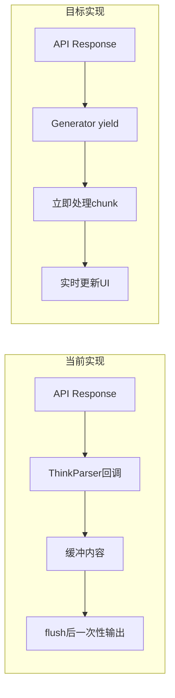
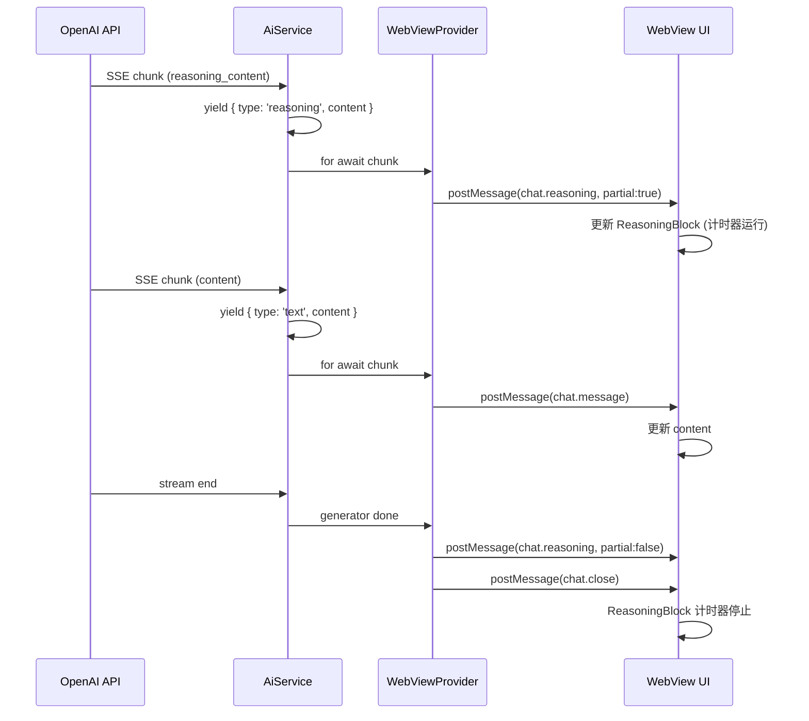

# 流式输出重构计划

## 架构对比



## 变更范围

### 1. Extension 层 - AI 服务重构

**文件: [packages/extension/src/ai_service.ts](packages/extension/src/ai_service.ts)**

定义新的 Stream 类型和 Chunk 类型：

```typescript
// 新增类型定义
export type ApiStreamChunk = 
  | { type: 'text'; content: string }
  | { type: 'reasoning'; content: string }
  | { type: 'tool_call'; toolCall: ToolCall }
  | { type: 'tool_call_delta'; index: number; delta: Partial<ToolCall> }
  | { type: 'usage'; inputTokens: number; outputTokens: number };

export type ApiStream = AsyncGenerator<ApiStreamChunk, void, unknown>;
```

将 `chat()` 方法从 callback 模式改为 generator 模式：

```typescript
// 之前: callback 模式
public async chat(messages, callbacks, options): Promise<void>

// 之后: generator 模式  
public async *createMessage(messages, options): ApiStream
```

移除 `ThinkParser` 的缓冲逻辑，改为直接 yield：

- 检测到 `reasoning_content` 字段时 yield `{ type: 'reasoning', content }`
- 检测到 `content` 字段时 yield `{ type: 'text', content }`
- 检测到 `tool_calls` 时 yield `{ type: 'tool_call', toolCall }`

### 2. Extension 层 - WebView Provider 重构

**文件: [packages/extension/src/webview-view-provider.ts](packages/extension/src/webview-view-provider.ts)**

修改 `_handleChatInvoke()` 方法来消费 generator：

```typescript
private async _handleChatInvoke(userMessage: string) {
  // 1. 发送 chat.open
  this._sendChatOpen();
  
  // 2. 消费 generator stream
  let reasoningContent = '';
  let textContent = '';
  
  for await (const chunk of aiService.createMessage(messages, options)) {
    switch (chunk.type) {
      case 'reasoning':
        reasoningContent += chunk.content;
        // 发送独立的 reasoning 消息（partial: true）
        this._sendReasoningMessage(reasoningContent, true);
        break;
        
      case 'text':
        textContent += chunk.content;
        // 发送 text 消息
        this._sendTextMessage(textContent, true);
        break;
        
      case 'tool_call':
        // 处理工具调用
        this._sendToolCall(chunk.toolCall);
        break;
    }
  }
  
  // 3. 完成时发送 partial: false
  if (reasoningContent) {
    this._sendReasoningMessage(reasoningContent, false);
  }
  this._sendTextMessage(textContent, false);
  this._sendChatClose();
}
```

新增消息类型：

```typescript
// 新增 reasoning 消息命令
private _sendReasoningMessage(content: string, partial: boolean) {
  this._view?.webview.postMessage({
    command: "xiaoke.webview.chat.reasoning",
    payload: { content, partial },
  });
}
```

### 3. WebView UI - 消息类型重构

**文件: [packages/webview-ui/src/App3.vue](packages/webview-ui/src/App3.vue)**

修改消息监听，处理独立的 reasoning 消息：

```typescript
// 新增消息类型
type VscodeChatReasoning = {
  command: 'xiaoke.webview.chat.reasoning';
  payload: { content: string; partial: boolean };
};

// 新增处理函数
const handleReasoningMessage = (content: string, partial: boolean) => {
  const msg = messages.value[index.value] as AMessage;
  msg.reasoning_content = content;
  msg.reasoningPartial = partial;
  
  // 更新计时器
  if (partial && !msg.reasoningStartTime) {
    msg.reasoningStartTime = Date.now();
  }
  scrollToBottom();
};
```

更新 AMessage 类型：

```typescript
export type AMessage = {
  role: 'assistant';
  content: string;
  reasoning_content: string;
  reasoningPartial?: boolean;      // 新增
  reasoningStartTime?: number;     // 新增：计时起始时间
  status: MessageStatus;
  toolCalls?: ToolCallInfo[];
};
```

### 4. WebView UI - ReasoningBlock 组件

**新建文件: [packages/webview-ui/src/components/ReasoningBlock.vue](packages/webview-ui/src/components/ReasoningBlock.vue)**

创建专用的 ReasoningBlock 组件（参考 Roo-Code 的 ReasoningBlock.tsx）：

```vue
<template>
  <div class="reasoning-block">
    <!-- 头部：点击可折叠 -->
    <div class="reasoning-header" @click="toggleCollapse">
      <i class="codicon codicon-lightbulb" />
      <span class="reasoning-title">思考过程</span>
      <span v-if="elapsedSeconds > 0" class="reasoning-time">
        {{ elapsedSeconds }}秒
      </span>
      <i :class="['codicon', 'codicon-chevron-up', { collapsed: isCollapsed }]" />
    </div>
    
    <!-- 内容：可折叠 -->
    <div v-if="!isCollapsed && content" class="reasoning-content">
      <div v-html="renderedContent" />
    </div>
  </div>
</template>

<script setup lang="ts">
// Props
const props = defineProps<{
  content: string;
  isStreaming: boolean;  // 是否正在流式输出
  isLast: boolean;       // 是否是最后一条消息
  startTime?: number;    // 开始时间戳
}>();

// 折叠状态
const isCollapsed = ref(false);
const toggleCollapse = () => { isCollapsed.value = !isCollapsed.value; };

// 计时器（仅在最后一条消息流式输出时启用）
const elapsedSeconds = ref(0);
let timerId: number | null = null;

watchEffect(() => {
  if (props.isLast && props.isStreaming && props.startTime) {
    // 启动计时器
    const tick = () => {
      elapsedSeconds.value = Math.floor((Date.now() - props.startTime!) / 1000);
    };
    tick();
    timerId = setInterval(tick, 1000);
  } else if (timerId) {
    clearInterval(timerId);
    timerId = null;
  }
});

onUnmounted(() => {
  if (timerId) clearInterval(timerId);
});
</script>
```

### 5. WebView UI - 更新 AssistantMessage

**文件: [packages/webview-ui/src/AssistantMessage.vue](packages/webview-ui/src/AssistantMessage.vue)**

替换 `<details>` 为 `ReasoningBlock` 组件：

```vue
<!-- 之前 -->
<details v-if="reasoning_content" class="reasoning-details">
  <summary>思考过程</summary>
  <div v-html="markdowned_reasoning_content" />
</details>

<!-- 之后 -->
<ReasoningBlock
  v-if="reasoning_content"
  :content="reasoning_content"
  :isStreaming="reasoningPartial"
  :isLast="isLast"
  :startTime="reasoningStartTime"
/>
```

新增 props：

```typescript
const props = defineProps<{
  content: string;
  reasoning_content: string;
  reasoningPartial?: boolean;      // 新增
  reasoningStartTime?: number;     // 新增
  isLast?: boolean;                // 新增
  status: MessageStatus;
  toolCalls?: ToolCallInfo[];
}>();
```

## 数据流图



## 关键变更点

1. **移除 ThinkParser 的缓冲逻辑** - 不再等待 `<think>` 标签，直接根据字段类型 yield
2. **Generator 模式** - 使用 `async *createMessage()` 替代 callback
3. **独立的 Reasoning 消息** - 通过 `chat.reasoning` 命令发送，支持 partial 更新
4. **ReasoningBlock 组件** - 专用组件，带折叠状态和计时功能
5. **实时更新** - 每个 chunk 立即 yield 并发送到 WebView

## 文件修改清单

| 文件 | 修改类型 | 说明 |

|------|----------|------|

| `packages/extension/src/ai_service.ts` | 重构 | callback -> generator |

| `packages/extension/src/webview-view-provider.ts` | 修改 | 消费 generator，新增 reasoning 消息 |

| `packages/webview-ui/src/App3.vue` | 修改 | 处理 reasoning 消息 |

| `packages/webview-ui/src/AssistantMessage.vue` | 修改 | 使用 ReasoningBlock |

| `packages/webview-ui/src/components/ReasoningBlock.vue` | 新建 | 专用组件 |

| `packages/extension/src/think-parser.ts` | 删除或简化 | 移除缓冲逻辑 |