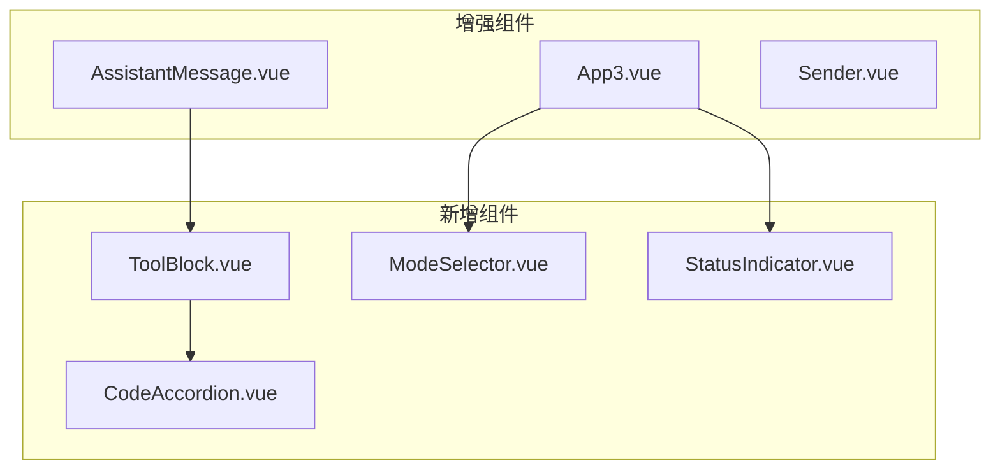

# Webview UI 增强计划

## 目标

参考 Roo-Code 的 UI 设计，为 vscode-tools 添加以下可视化功能：

1. 工具调用显示（文件操作、命令执行、搜索等）
2. 改进的模式选择器
3. 状态指示器
4. 代码块折叠

## 当前 UI 结构

```
packages/webview-ui/src/
├── App3.vue              # 主应用
├── AssistantMessage.vue  # AI 消息（支持思考/回答）
├── UserMessage.vue       # 用户消息
├── Sender.vue            # 输入框
└── components/
    └── MessageBubble.vue
```

## 设计方案

### 1. 新增组件



---

## 阶段 1: 工具调用显示组件

### 1.1 ToolBlock.vue - 工具调用块

参考 Roo-Code 的 `ChatRow.tsx` 中的工具显示模式：

```vue
<!-- 结构设计 -->
<div class="tool-block">
  <div class="tool-header">
    <i :class="iconClass" />
    <span class="tool-title">{{ title }}</span>
    <span class="tool-status">{{ statusText }}</span>
  </div>
  <div class="tool-content">
    <slot />
  </div>
</div>
```

**支持的工具类型：**

| 工具 | 图标 | 标题格式 |

|------|------|----------|

| read_file | codicon-file | 读取文件: {path} |

| write_to_file | codicon-new-file | 写入文件: {path} |

| list_files | codicon-folder | 列出目录: {path} |

| search_files | codicon-search | 搜索: {pattern} |

| execute_command | codicon-terminal | 执行命令: {cmd} |

### 1.2 CodeAccordion.vue - 可折叠代码块

参考 Roo-Code 的折叠设计，用于显示大段代码/输出：

```vue
<details class="code-accordion" :open="defaultOpen">
  <summary>
    <i class="codicon codicon-chevron-right" />
    {{ title }}
    <span class="line-count">{{ lineCount }} 行</span>
  </summary>
  <pre><code>{{ content }}</code></pre>
</details>
```

---

## 阶段 2: 改进模式选择器

### 2.1 ModeSelector.vue - 模式选择器

参考 Roo-Code 的 `ModeSelector.tsx` 设计：

**当前设计（简单下拉框）:**

```vue
<select v-model="currentModeSlug">
  <option v-for="mode in modes" :value="mode.slug">
    {{ mode.name }}
  </option>
</select>
```

**改进设计（带图标和描述）:**

```vue
<div class="mode-selector">
  <button class="mode-trigger" @click="toggle">
    <i :class="currentModeIcon" />
    <span>{{ currentMode.name }}</span>
    <i class="codicon codicon-chevron-down" />
  </button>
  <div v-if="isOpen" class="mode-dropdown">
    <div v-for="mode in modes" 
         :class="['mode-item', { active: mode.slug === currentModeSlug }]"
         @click="selectMode(mode.slug)">
      <i :class="getModeIcon(mode.slug)" />
      <div class="mode-info">
        <span class="mode-name">{{ mode.name }}</span>
        <span class="mode-desc">{{ mode.description }}</span>
      </div>
      <i v-if="mode.readonly" class="codicon codicon-lock" title="只读" />
    </div>
  </div>
</div>
```

**模式图标映射：**

- code: `codicon-code`
- architect: `codicon-organization`
- ask: `codicon-question`
- debug: `codicon-debug`

---

## 阶段 3: 增强 AssistantMessage.vue

### 3.1 支持工具调用显示

当前 AssistantMessage 只显示文本，需要支持解析和显示工具调用：

```vue
<template>
  <div class="assistant-message-container">
    <i class="codicon codicon-robot assistant-message-icon" />
    <div class="assistant-message-content">
      <!-- 思考内容 -->
      <details v-if="reasoning_content" class="reasoning-details">
        ...
      </details>
      
      <!-- 工具调用块（新增） -->
      <ToolBlock v-for="tool in toolCalls" :key="tool.id"
        :type="tool.name"
        :args="tool.args"
        :result="tool.result"
        :status="tool.status"
      />
      
      <!-- 回答内容 -->
      <div v-html="markdowned_content" class="answering-text" />
    </div>
  </div>
</template>
```

### 3.2 新增 Props

```typescript
interface ToolCallInfo {
  id: string;
  name: string;
  args: Record<string, unknown>;
  result?: { success: boolean; content: string; error?: string };
  status: 'pending' | 'running' | 'success' | 'error';
}

defineProps<{
  content: string;
  reasoning_content: string;
  status: 'thinking' | 'answering' | 'completed';
  toolCalls?: ToolCallInfo[];  // 新增
}>();
```

---

## 阶段 4: App3.vue 增强

### 4.1 工具调用状态管理

更新消息类型以支持工具调用：

```typescript
export type AMessage = {
  role: 'assistant';
  content: string;
  reasoning_content: string;
  status: 'thinking' | 'answering' | 'completed';
  toolCalls?: ToolCallInfo[];  // 新增
};
```

### 4.2 处理工具消息

在 `vscodeListener` 中处理工具调用和结果：

```typescript
case 'xiaoke.webview.tool.call': {
  const { name, args } = payload;
  // 添加到当前消息的 toolCalls
  addToolCall(name, args);
  break;
}
case 'xiaoke.webview.tool.result': {
  const { name, result } = payload;
  // 更新对应工具调用的结果
  updateToolResult(name, result);
  break;
}
```

---

## 阶段 5: 状态指示器

### 5.1 StatusIndicator.vue

显示当前状态（准备中/思考中/执行工具/回答中）：

```vue
<div class="status-indicator">
  <div class="status-dot" :class="statusClass" />
  <span class="status-text">{{ statusText }}</span>
</div>
```

**状态映射：**

| 状态 | 颜色 | 文本 |

|------|------|------|

| ready | 绿色 | 准备就绪 |

| thinking | 蓝色闪烁 | 正在思考... |

| tooling | 黄色闪烁 | 执行工具中... |

| answering | 蓝色 | 正在回答... |

---

## 阶段 6: 样式优化

### 6.1 新增 CSS 变量

在 `index.css` 中添加工具块样式：

```css
/* 工具块样式 */
.tool-block {
  border: 1px solid var(--vscode-widget-border);
  border-radius: 4px;
  margin: 8px 0;
  overflow: hidden;
}

.tool-header {
  display: flex;
  align-items: center;
  gap: 8px;
  padding: 8px 12px;
  background: var(--vscode-editor-inactiveSelectionBackground);
  border-bottom: 1px solid var(--vscode-widget-border);
}

.tool-content {
  padding: 8px 12px;
  font-family: var(--vscode-editor-font-family);
  font-size: var(--vscode-editor-font-size);
}

/* 状态指示器 */
.status-dot {
  width: 8px;
  height: 8px;
  border-radius: 50%;
}

.status-dot.ready { background: var(--vscode-testing-iconPassed); }
.status-dot.thinking { background: var(--vscode-progressBar-background); animation: pulse 1s infinite; }
.status-dot.error { background: var(--vscode-testing-iconFailed); }

@keyframes pulse {
  0%, 100% { opacity: 1; }
  50% { opacity: 0.5; }
}
```

---

## 文件变更清单

| 文件 | 变更类型 | 说明 |

|------|----------|------|

| `src/components/ToolBlock.vue` | 新建 | 工具调用显示组件 |

| `src/components/CodeAccordion.vue` | 新建 | 可折叠代码块 |

| `src/components/ModeSelector.vue` | 新建 | 改进的模式选择器 |

| `src/components/StatusIndicator.vue` | 新建 | 状态指示器 |

| `src/AssistantMessage.vue` | 修改 | 添加工具调用显示 |

| `src/App3.vue` | 修改 | 集成新组件、工具状态管理 |

| `src/index.css` | 修改 | 添加新样式 |

---

## UI 预览

```
┌─────────────────────────────────────┐
│ [代码模式 ▼]            [●] 准备就绪 │  <- 模式选择器 + 状态
├─────────────────────────────────────┤
│                                     │
│ ┌─────────────────────────────┐ 👤 │  <- 用户消息
│ │ 请帮我读取 package.json 文件  │    │
│ └─────────────────────────────┘    │
│                                     │
│ 🤖 ┌─────────────────────────────┐ │  <- AI 消息
│    │ ▶ 思考中...                  │ │
│    ├─────────────────────────────┤ │
│    │ 📄 读取文件: package.json    │ │  <- 工具调用块
│    │ ┌─────────────────────────┐ │ │
│    │ │ ▼ 文件内容 (80 行)       │ │ │  <- 可折叠
│    │ │ {                       │ │ │
│    │ │   "name": "vscode-tools"│ │ │
│    │ │   ...                   │ │ │
│    │ └─────────────────────────┘ │ │
│    ├─────────────────────────────┤ │
│    │ 这是你的 package.json 文件  │ │  <- 回答内容
│    └─────────────────────────────┘ │
│                                     │
├─────────────────────────────────────┤
│ [清除历史]                          │
│ ┌─────────────────────────────────┐ │
│ │ 输入消息...                      │ │
│ └─────────────────────────────────┘ │
│                              [发送] │
└─────────────────────────────────────┘
```