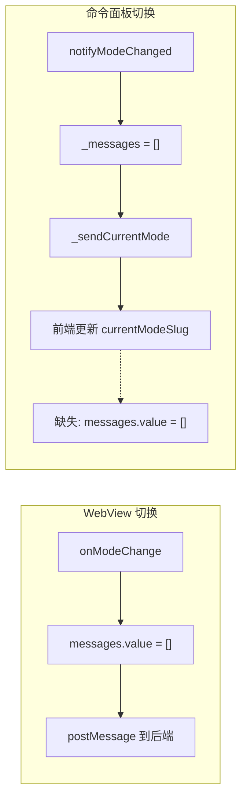

# 前端消息清除同步修复

## 问题分析

当前数据流对比：



后端清除了 `_messages`，但前端的 `messages.value` 未被清除。

## 修复方案

在 `notifyModeChanged()` 中添加一条 `xiaoke.webview.history.clear` 消息，通知前端清除消息。

### 1. 修改 [webview-view-provider.ts](packages/extension/src/webview-view-provider.ts)

在 `notifyModeChanged()` 方法中添加发送清除历史的消息：

```typescript
public notifyModeChanged(): void {
  this._sendCurrentMode();
  this._messages = [];
  // 新增：通知前端清除聊天历史
  this._view?.webview.postMessage({
    command: "xiaoke.webview.history.clear",
  });
  console.log("模式已通过外部命令切换，UI 已同步，历史已清除");
}
```

### 2. 修改 [App3.vue](packages/webview-ui/src/App3.vue)

在 `vscodeListener` 的 switch 语句中添加处理 `xiaoke.webview.history.clear`：

```typescript
case 'xiaoke.webview.history.clear': {
  messages.value = [];
  break;
}
```

## 修改文件清单

- `packages/extension/src/webview-view-provider.ts`: 在 `notifyModeChanged()` 中发送清除消息
- `packages/webview-ui/src/App3.vue`: 处理 `xiaoke.webview.history.clear` 消息